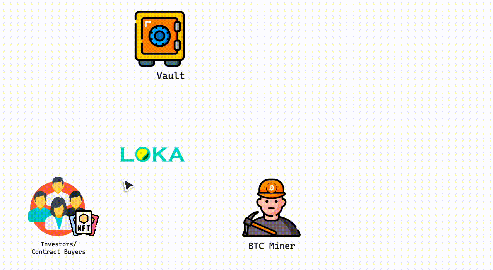
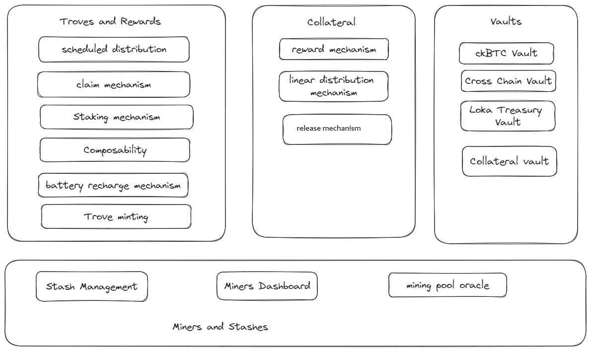
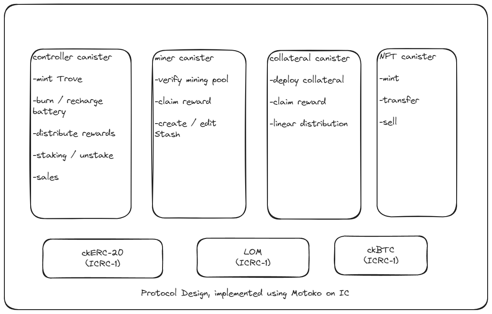

# Loka

Loka is a platform that enables retail investors to acquire BTC at better than market prices through co-investing with Bitcoin miners. The arrangement is based on a trustless non-custodial escrow solution, which eliminates any exposure to centralized party risk.

https://lokamining.com

With Loka :

- Miners can get upfront reward in stable currency, benefiting in value of present
- Retail investors can have access to safe, secure, decentralized, and collateralized bitcoin mining
- Collateral provider can deposit their collateral and gain profit from Loka transactions

### Terms

Loka has several main terms that should be remembered :

1. Stash : Stash is a term for hashrate produced by miner, which then transferred to Loka, therefore redirecting their bitcoin mining rewards to Loka
2. Trove : Trove is a chunk of Stash, purchased by retail investor therefore miner will get $ as "hashrate rent contract", and retail investor will get bitcoin reward from the Trove they bought
3. Battery : Each Trove, which is actually hashrate, needs cost to pay their electricity, which the term "Battery" is a self explanatory, a token to recharge Trove. Optionally, retail investor can recharge their "Battery" by purchasing ckERC-20 stable coin, or by letting Loka to substract their bitcoin mining reward to pay for the battery cost.

## Introduction

This project is a set of Motoko canister implementing trustless, decentralized, and collateralized bitcoin mining platform.
It handles business models for 3 actors : the miners, liquidity providers, and retail investors.
Loka run on Internet Computer, leveraging ckBTC, a non-custodial bitcoin wrapper, allowing users to safely use bitcoin transaction in an extremely faster execution.

In this protocol:

- Miner can transfer their hashrate to Loka, and creating Stash and Troves to be sold to retail investors.
- Retail investor can rent hashrate from miner and directly claim ckBTC to their wallet as mining rewards.
- Liquidity provider can deposit their collateral to the miners they trust, and claim profit from transactions.

This is how the business model is represented by ICP canisters.

## Technical Architecture

### Overview



### Protocol Design

Based on the business model, canister represented as diagram below


### Miners

Miners business flow represented as follow


Liquidity Provider business flow represented as follow


### Lokamining

And this is the flow for retail user


### Collateral

(coming soon)

### Front End

## Installation

Step-by-step guide to get a copy of the project up and running locally for development and testing.

### Prerequisites

IC SDK (https://internetcomputer.org/docs/current/developer-docs/setup/install/) (Mac/Linux and Windows with WSL)

### Install

A step-by-step guide to installing the project, including necessary configuration etc.

#### Setting up environment

```bash
$ git clone <GitHub repo>
$ cd <project>
$ npm install

```

#### Deploying local ICRC1 token canisters

These tokens are being used as currencies in Loka ecosystem.
In production environment, LBTC should be replaced by ckBTC ledger on ICP.
LBTC is a token to represent Bitcoin mining reward, which is ckBTC in mainnet
LOM is Loka native token, rewarded for staked NFTs
ckUSD is a stable currency being used to purchase Loka mining Troves and Battery power.

These tokens will be required as dependency by several other Loka canisters

Now lets deploy these local tokens (make sure you are still in the project root directory) :

```bash
$ export MINTER = $(dfx identity get-principal)

$ dfx deploy lbtc  --argument "(variant {Init =
record {
     token_symbol = \"LBTC\";
     token_name = \"LBTC\";
     minting_account = record { owner = principal \"${MINTER}\" };
     transfer_fee = 10;
     metadata = vec {};
     feature_flags = opt record{icrc2 = true};
     initial_balances = vec { record { record { owner = principal \"${MINTER}\"; }; 1000000000000; }; };
     archive_options = record {
         num_blocks_to_archive = 1000;
         trigger_threshold = 2000;
         controller_id = principal \"${MINTER}\";
         cycles_for_archive_creation = opt 10000000000000;
     };
 }
})"

dfx deploy lbtc  --argument "(variant {Init =
record {
     token_symbol = \"EYES\";
     token_name = \"EYES\";
     minting_account = record { owner = principal \"s4bfy-iaaaa-aaaam-ab4qa-cai\" };
     transfer_fee = 0;
     metadata = vec {};
     feature_flags = opt record{icrc2 = true};
     initial_balances = vec { record { record { owner = principal \"s4bfy-iaaaa-aaaam-ab4qa-cai\"; }; 1000000000000; }; };
     archive_options = record {
         num_blocks_to_archive = 1000;
         trigger_threshold = 2000;
         controller_id = principal \"s4bfy-iaaaa-aaaam-ab4qa-cai\";
         cycles_for_archive_creation = opt 10000000000000;
     };
 }
})" --network ic

s4bfy-iaaaa-aaaam-ab4qa-cai

$ dfx deploy lom  --argument "(variant {Init =
record {
     token_symbol = \"LOM\";
     token_name = \"LOM\";
     minting_account = record { owner = principal \"${MINTER}\" };
     transfer_fee = 0;
     metadata = vec {};
     feature_flags = opt record{icrc2 = true};
     initial_balances = vec { record { record { owner = principal \"${MINTER}\"; }; 1000000000000; }; };
     archive_options = record {
         num_blocks_to_archive = 1000;
         trigger_threshold = 2000;
         controller_id = principal \"${MINTER}\";
         cycles_for_archive_creation = opt 10000000000000;
     };
 }
})"


$ dfx deploy stable  --argument "(variant {Init =
record {
     token_symbol = \"LUSD\";
     token_name = \"LUSD\";
     minting_account = record { owner = principal \"${MINTER}\" };
     transfer_fee = 0;
     metadata = vec {};
     feature_flags = opt record{icrc2 = true};
     initial_balances = vec { record { record { owner = principal \"${MINTER}\"; }; 1000000000000; }; };
     archive_options = record {
         num_blocks_to_archive = 1000;
         trigger_threshold = 2000;
         controller_id = principal \"${MINTER}\";
         cycles_for_archive_creation = opt 10000000000000;
     };
 }
})"


$ dfx deploy tempeeyes  --argument "(variant {Init =
record {
     token_symbol = \"EYI\";
     token_name = \"EYI\";
     minting_account = record { owner = principal \"s4bfy-iaaaa-aaaam-ab4qa-cai\" };
     transfer_fee = 0;
     metadata = vec {};
     feature_flags = opt record{icrc2 = true};
     initial_balances = vec { record { record { owner = principal \"s4bfy-iaaaa-aaaam-ab4qa-cai\"; }; 1000000000000; }; };
     archive_options = record {
         num_blocks_to_archive = 1000;
         trigger_threshold = 2000;
         controller_id = principal \"s4bfy-iaaaa-aaaam-ab4qa-cai\";
         cycles_for_archive_creation = opt 10000000000000;
     };
 }
})"


dfx deploy ckbtc_prod --network ic  --argument "(variant {Init =
record {
     token_symbol = \"LBTC\";
     token_name = \"LBTC\";
     minting_account = record { owner = principal \"2zosz-ithna-3dqa4-crx3i-2gy7e-o3rkp-fa6wk-mczsu-3h7bi-poiym-hae\" };
     transfer_fee = 0;
     metadata = vec {};
     feature_flags = opt record{icrc2 = true};
     initial_balances = vec { record { record { owner = principal \"2zosz-ithna-3dqa4-crx3i-2gy7e-o3rkp-fa6wk-mczsu-3h7bi-poiym-hae\"; }; 1000000000000; }; };
     archive_options = record {
         num_blocks_to_archive = 1000;
         trigger_threshold = 2000;
         controller_id = principal \"2zosz-ithna-3dqa4-crx3i-2gy7e-o3rkp-fa6wk-mczsu-3h7bi-poiym-hae\";
         cycles_for_archive_creation = opt 10000000000000;
     };
 }
})"

```

#### Deploying mainnet ckBTC interface canisters

On mainnet, Loka will be using ckBTC (which represented by LBTC on local deployment)
You can follow the step to deploy ckBTC interface canister here :

```bash
$ export MINTER = $(dfx identity get-principal)
$ dfx deploy ckbtc_prod  --argument "(variant {Init =
record {
     token_symbol = \"CKBTC\";
     token_name = \"CKBTC\";
     minting_account = record { owner = principal \"${MINTER}\" };
     transfer_fee = 0;
     metadata = vec {};
     feature_flags = opt record{icrc2 = true};
     initial_balances = vec { record { record { owner = principal \"${MINTER}\"; }; 1000000000000; }; };
     archive_options = record {
         num_blocks_to_archive = 1000;
         trigger_threshold = 2000;
         controller_id = principal \"${MINTER}\";
         cycles_for_archive_creation = opt 10000000000000;
     };
 }
})" --network ic

```

#### Deploying Loka Mining Site Canister

\*This part will soon be deprecated as it will be merged with Loka Miner Canister in this document

Initially, this canister will act as mining site ledger, managing the data of all mining sites (or hashrates) all over the world and Stashes in Loka ecosystem

```bash
$ export MINTER = $(dfx identity get-principal)
$ dfx deploy xdragon --argument '(record{admin = principal "2zosz-ithna-3dqa4-crx3i-2gy7e-o3rkp-fa6wk-mczsu-3h7bi-poiym-hae"})' --network ic

```

#### Deploying Loka NFT Canister

To make Loka Troves composable across the chain, whether to be used as collateral for DeFi loans, trading, and such, Loka represent Trove as NFT

```bash
$ export MINTER = $(dfx identity get-principal)
$ dfx deploy nft --argument '(principal "${MINTER}")'

```

#### Deploying Loka Mining Site Controller

This canister works as business logic provider, as all the business logic execution and schedulers are being handled by Controller Canister.
Including :

1. minting new Trove
2. claiming ckBTC reward by retail user
3. distributing ckBTC reward by system every 24 hours

deployment example :

```bash
$ export MINTER = $(dfx identity get-principal)
$ dfx deploy controller --argument '(record{admin = principal "2zosz-ithna-3dqa4-crx3i-2gy7e-o3rkp-fa6wk-mczsu-3h7bi-poiym-hae";hashrate=0.035; electricity = 0.035; miningSiteIdparam = 1 ; siteName = "jakarta-1"; totalHashrate =4000.0 ;})'

```

\*This part will soon be deprecated as it will be merged with Loka Miner Canister in this document

#### Deploying Loka Miner Canister

Miner Canister manages all Stashes from onboarding miners, to claiming bitcoin rewards.
All Troves created are based on Stash data from this canister.
It has dependency to ckBTC ledger and an external API to transfer USDT to miner's wallet

```bash
$ export MINTER = $(dfx identity get-principal)
$ dfx deploy miner --argument '(record{admin = principal "${MINTER}"})'

```

Miner Canister has its own front end to differentiate it from retail investor.

#### Setting up initial data and mining sites

getting canister ids

```bash
$ dfx canister id nft
$ dfx canister id controller
```

setting up controller canister to manage nft canister

```bash
$ dfx canister call (nft name) setMinter '(principal "your controller id")'

```

put some LBTC token to represent bitcoin mining rewards to your controller

```bash
$ dfx canister call lbtc icrc1_transfer "(record { to = record { owner = principal \"bw4dl-smaaa-aaaaa-qaacq-cai\";};  amount = 10_000_000_000_000;})" --network ic
 rg2ah-xl6x4-z6svw-bdxfv-klmal-cwfel-cfgzg-eoi6q-nszv5-7z5hg-sqe
```

52nf6-f5syy-tjpga-fbnli-gfqcp-bvfwb-2vona-lf3qh-u3ssq-wuyti-3ae

dfx canister call ckbtc_test icrc1_transfer "(record { to = record { owner = principal \"o4k35-i6lb3-mfi6a-6mwzo-iuxj6-qci6k-l7whg-3ntvl-2vcum-dq7ac-2qe\";}; amount = 10_000_000_00;})" --network ic

dfx canister call lbtc icrc1_transfer "(record { to = record { owner = principal \"gq3rs-huaaa-aaaaa-qaasa-cai\";}; amount = 100_000_000_000;})"

register the controller to miningSite canister

```bash
$ dfx canister call loka addMiningSite '("Jakarta", "jakarta-1", 0.035,0.035,4000,"7dktp-hiaaa-aaaam-ab2ea-cai", "7elv3-kqaaa-aaaam-ab2eq-cai")'

```

And Loka canisters is ready
Miners can send their hashrate
Retail user can create their Trove

## Usage

Front End example for Loka protocol can be found here :
And Loka Miners here :

### Minting new Trove

Usage examples can be canister calls:

`

## Documentation

Further documentation can exist in the README file if the project only contains a few functions. It can also be located elsewhere, if it is extensive, if this is the case, link to it.

## Roadmap

Describe the project roadmap, this could be the grant milestones, but it could also be the team's broader project roadmap.

- [Q4 2023] Alpha Launch - Miner Dashboard
- [Q1 2024] Lokamining Launch
- [Q2 2024] Trove Bear and Bull Vault

## License

This project is licensed under the GNU 3 license

## References

- [Internet Computer](https://internetcomputer.org)
- [Loka Whitepaper]
- [Loka Technical Documentation](https://lokamining.gitbook.com)
