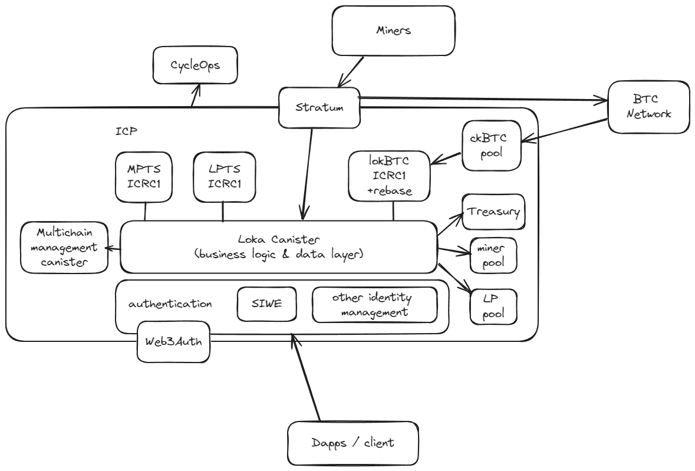
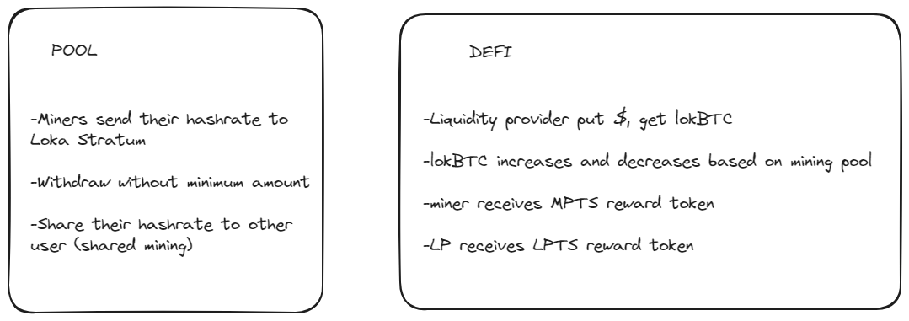

# Loka

Loka is

https://lokamining.com

With Loka :

- Miners can get upfront reward in stable currency, benefiting in value of present
- Retail investors can have access to safe, secure, decentralized, and collateralized bitcoin mining
- Collateral provider can deposit their collateral and gain profit from Loka transactions

### Terms

## Introduction

This project is a set of Motoko canister implementing trustless, decentralized, and collaterallized, tokenized bitcoin mining ecosystem.
It handles business models for 3 actors : the miners, liquidity providers, and retail investors.
Loka run on Internet Computer, leveraging ckBTC, a non-custodial bitcoin wrapper, allowing users to safely use bitcoin transaction in an extremely faster execution.

In this protocol:

- Miner can transfer their hashrate to Loka, via our stratum server.
- Liquidity provider can deposit their collateral to the Loka mining ecosystem.
- Incentive engine : MPTS and LPTS
- lokBTC : a rebase-able ICRC1-based token

This is how the business model is represented by ICP canisters.

## Technical Architecture

### Overview



### Core Feautures



### Front End

refer to
https://github.com/lokaverse/defi
https://github.com/lokaverse/pool

## Installation

Step-by-step guide to get a copy of the project up and running locally for development and testing.

### Prerequisites

IC SDK (https://internetcomputer.org/docs/current/developer-docs/setup/install/) (Mac/Linux and Windows with WSL)

### Install

Steps to install the project :

1. deploy ckBTC_test (for development purpose)
2. deploy lokBTC, a rebase-able token
3. deploy MPTS and LPTS reward tokens
4. deploy pool canister
5. deploy defi canister

#### Setting up environment

```bash
$ git clone <this GitHub repo>
$ cd <project>
$ npm install

```

#### Deploying Pool and Defi canisters

dfx deploy pool --argument '(record{admin = principal "[controller principal]"})' --network ic
dfx canister call pool init '(false)' --network ic;

sudo dfx deploy defi --argument '(record{admin = principal "[controller principal]"})' --network ic
sudo dfx canister call defi init --network ic

dfx canister id defi (save the principal id for later)

#### Deploying MPTS, and LPTS canisters

MPTS and LPTS are reward tokens to be given to miner and LPs, alongside BTC reward from RWA mining
the minter of MPTS and LPTS is the DEFI canister, so make sure to put DEFI canister principal as minting account for these tokens
Now lets deploy these local tokens (make sure you are still in the project root directory) :

```bash
$ export MINTER = $(dfx identity get-principal)

$ dfx deploy mpts  --argument "(variant {Init =
record {
     token_symbol = \"[token symbol]\";
     token_name = \"[token name]\";
     minting_account = record { owner = principal \"[DEFI PRINCIPAL ID]\" };
     transfer_fee = 10;
     metadata = vec {};
     feature_flags = opt record{icrc2 = true};
     initial_balances = vec { record { record { owner = principal \"${MINTER}\"; }; 1000000000000; }; };
     archive_options = record {
         num_blocks_to_archive = 1000;
         trigger_threshold = 2000;
         controller_id = principal \"${MINTER}\";
         cycles_for_archive_creation = opt 10000000000000;
     };
 }
})"

$ dfx deploy lpts  --argument "(variant {Init =
record {
     token_symbol = \"[token symbol]\";
     token_name = \"[token name]\";
     minting_account = record { owner = principal \"[DEFI PRINCIPAL ID]\" };
     transfer_fee = 10;
     metadata = vec {};
     feature_flags = opt record{icrc2 = true};
     initial_balances = vec { record { record { owner = principal \"${MINTER}\"; }; 1000000000000; }; };
     archive_options = record {
         num_blocks_to_archive = 1000;
         trigger_threshold = 2000;
         controller_id = principal \"${MINTER}\";
         cycles_for_archive_creation = opt 10000000000000;
     };
 }
})"


```

you can also deploy a ckbtc_test token to represent ckbtc by running deploy_test_ckbtc.sh under "runners" directory
dont forget to change the principal to your deployer principal id

#### Deploying lokBTC canisters

lokBTC is a rebase-able token based on ICRC1
the total supply will be rebased every 24 hour, referring to mining pool wallet ckBTC balance
the balance for each lokBTC holder will be proportional to how many ckBTC they staked in the staking pool

first, change the minting account with DEFI principal address on deploy_local_lokbtc.sh file under "runners" dir

```bash
minting_account = opt record{
    owner = principal \"[change to your DEFI principal id]\";
    subaccount = null;
  };
```

then run

```bash

sudo sh ./runners/deploy_local_lokbtc.sh
sudo sh ./runners/deploy_pool.sh
sudo sh ./runners/deploy_defi.sh

```

And Loka canisters are ready
Miners can send their hashrate
LP can stake their BTC

## Roadmap

Describe the project roadmap, this could be the grant milestones, but it could also be the team's broader project roadmap.

- [Q1 2024] Alpha Launch - Pool (done)
- [Q3 2024] Lokamining Launch
- [Q4 2024] Forward Hashrate Marketplace

## License

This project is licensed under the GNU 3 license

## References

- [Internet Computer](https://internetcomputer.org)
